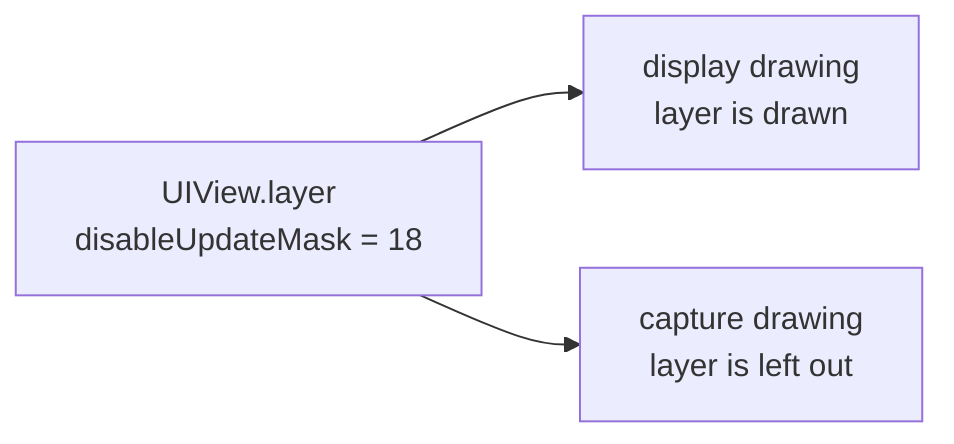
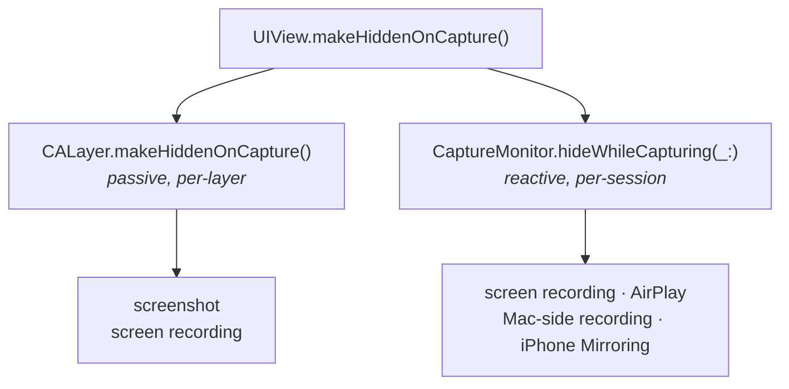
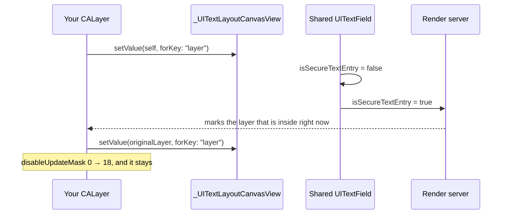
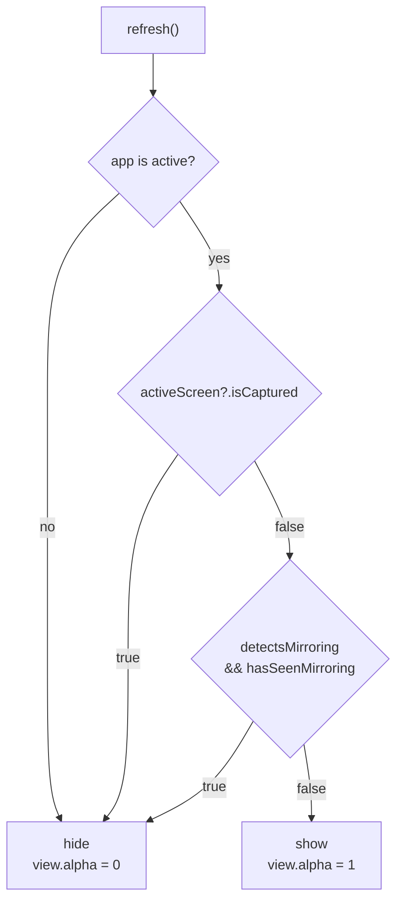
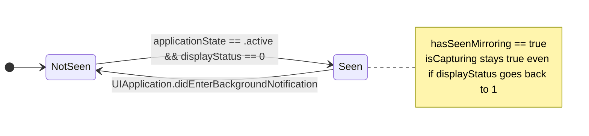
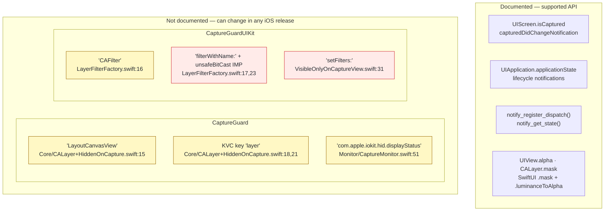

# How it works

## The idea

iOS draws the screen twice. One drawing goes to the display. The other goes to whatever is
capturing it. A layer can be marked so it is left out of the second drawing.



## Two mechanisms

A screenshot takes one frame, right now. There is no event to react to, so the layer has
to be marked before it happens.

A recording or a mirroring session lasts a while. The app can see it start and hide the
view until it ends.

CaptureGuard does both.



`CaptureMonitor` keeps the views in an `NSHashTable<UIView>.weakObjects()`. When
`isCapturing` changes, it sets `alpha` on each one.

## 1. The layer exclusion

A `UITextField` with `isSecureTextEntry` on hides its own text from captures. iOS does
this by leaving one internal layer out of the capture drawing.

There is no public API to ask for that. So the trick is to put your layer inside that text
field for a moment, let iOS mark it, then put the field's own layer back.



The change from `false` to `true` is what does the work. iOS marks whichever layer is
inside the field at that moment, and at that moment it is yours. The field stays secure
after the first call, so setting `true` again would change nothing. That is why the code
sets `false` first.

To check it worked, on a device:

```
(lldb) po myView.layer.value(forKey: "disableUpdateMask")   // 18 = applied, 0 = it did nothing
```

Four things to know:

- Calling it more than once is safe.
- It survives a frame change and `removeFromSuperview()`.
- Sublayers do **not** get the mark. Only the layer you call it on. So call it on the view
  that holds the secret, not on a parent far above it.
- The Simulator sets the mark and then ignores it.

## The mask

`visibleOnlyOnCapture()` is the same trick, turned around.

A mask turns brightness into opacity. White parts of the mask show the content. Black
parts hide it.

Both modifiers build the mask from two layers. One is normal. The other is capture-hidden.
In a capture the capture-hidden one is gone, so the mask flips.

| | base | capture-hidden layer | on screen | in a capture |
|---|---|---|---|---|
| `hiddenOnCapture()` | `.black` | `.white` | white wins → **visible** | white is gone → **hidden** |
| `visibleOnlyOnCapture()` | `.white` | `.black` | black wins → **hidden** | black is gone → **visible** |

`VisibleOnlyOnCaptureView` builds the same mask in Core Animation. UIKit has no public
`luminanceToAlpha`, so it has to find the private `CAFilter` class by name.

## 2. The capture monitor

The mark only changes the picture iOS makes. Mirroring ignores it. So `refresh()` decides
`isCapturing` from two things:



The first branch is not about capture. When the app stops being active, iOS takes a
snapshot for the app switcher, and shows it to anyone who opens the switcher. Hiding on
`willResignActive` keeps the secret out of that snapshot. `isCapturing` stays `false`
there, because nothing is capturing — the two states are tracked separately.

`isCaptured` is true for screen recording, AirPlay, and a recording started on a connected
Mac. It is false for iPhone Mirroring — see [iPhone Mirroring](#iphone-mirroring) below.

While the app is in front, `hasSeenMirroring` only goes one way:



`displayStatus` is the `com.apple.iokit.hid.displayStatus` notification, read with
`notify_get_state`. `0` means the phone's own screen is off. An app is only in front with
the screen off when something else is driving it.

It has to go one way. During mirroring you can press the power button: the screen turns
on, `displayStatus` becomes `1`, and the Mac keeps streaming. If the code checked again at
that moment it would show the content. Going to the background is the one thing a
mirroring session cannot survive, so that is the only thing that resets the flag.

`refresh()` runs on six `UIApplication` and `UIScreen` notifications, plus the
`displayStatus` callback. It never polls. If one of those is missed, `isCapturing` stays
wrong until the next one arrives.

## iPhone Mirroring

iPhone Mirroring shows your phone on a Mac. **iOS does not call it a capture**, so the
layer mark does nothing there. Content that is missing from a real screenshot shows up in
full in the mirrored window.

### What Apple says

Neither capture API reacts to it, and that is on purpose. A UIKit engineer on Apple
Developer Forums thread 762684 was asked why `sceneCaptureState` stays `inactive` under
iPhone Mirroring:

> This is expected. iPhone Mirroring is not treated as screen recording, but if you start a
> screen recording session on your Mac, you should see the capture state updated to match
> that.

DTS on thread 759314 was asked if an app can tell that it is being mirrored:

> There isn't a way to explicitly check for that case. I can't think of ways that you might
> work this out implicitly, but that isn't a good idea because such things can change over
> time.

The feature request that came out of it (FB14287821) was closed with no plans to fix it.

### Measured on a device

iPhone 13 Pro, iOS 26.5.2, while mirroring was running:

| Signal | Value | Useful? |
|---|---|---|
| `UIScreen.isCaptured` | `false` | no |
| `UITraitCollection.sceneCaptureState` | `.inactive` | no |
| `UIApplication.applicationState` | `.active` | half — see below |
| `com.apple.iokit.hid.displayStatus` | `0` screen off, `1` after waking it | **yes** |
| `UIScreen.brightness` | `0.0`, but `1.0` when locked at full brightness | no |
| `com.apple.springboard.lockstate` | `1` in one session, `0` in another | no |

### Two signals that did not work

- **`UIScreen.brightness == 0`.** This returns the user's brightness setting, not whether
  the screen is on. Lock the phone at full brightness and it still reads `1.0`, so the
  check never fires.
- **`com.apple.springboard.lockstate == 1`.** It reads fine (`notify_get_state` returns
  `0` for OK), but it said `1` in one mirroring session and `0` in another. A signal that
  changes inside one session is worse than no signal.

### What it uses instead

```swift
guard UIApplication.shared.applicationState == .active else { return false }
if let isDisplayOn = displayStatus?.state { return isDisplayOn == 0 }
return (activeScreen?.brightness ?? 1) <= 0.001   // fallback only
```

`displayStatus` comes from the Darwin notification API in `<notify.h>`, reached through the
`CNotify` target. `notify_get_state` is public. The *name* is not documented, and that is
the risky part.

The guess is off in the Simulator. There is no real screen there, so the notification is
never posted and its state stays `0` — which would look like a mirroring session that
never ends.

To turn it off completely: `CaptureMonitor.shared.detectsMirroring = false`.

### Testing it again after an iOS update

This is a guess, and it has broken twice already. Run the sample on a device and check all
five:

1. Mirror the phone → the content hides.
2. Press the power button during the session, without unlocking → it stays hidden.
3. Set brightness to full, lock the phone, then mirror → it hides.
4. Unlock the phone to end the session → the content comes back.
5. Lock and unlock the phone with no mirroring → the content comes back. This is the
   false-positive check.

## Limits

Read this before you ship. Most failures here are silent: the content stays visible and
nothing is logged.

### Nothing tells you when it breaks

There is no logging, no assert, and no error anywhere in `Sources/`. If a lookup fails,
`makeHiddenOnCapture()` returns normally and does nothing.

This is not theory. The first commit shipped `hiddenOnCapture()` with the capture-hidden
layer commented out. It protected nothing, there was no compile error, and the screen
looked the same. It was found a day later.

### What breaks on an iOS update

Here is everything the package touches, split by whether Apple documents it. The
documented half is stable. The other half is seven strings, and any of them can change
without warning.



**Yellow** goes quiet: the lookup misses, the content stays visible, nothing is logged.
**Red** throws an Objective-C exception instead. `setFilters:` is sent without a
`responds(to:)` check, and the `unsafeBitCast` call assumes a function signature that
nothing checks.

`LayerFilterFactory` is uneven about this. It guards the class and method *lookups* with
`guard let`, but not the *call*. So a missing class is safe and a changed signature is not.

Test on a device after every iOS release — see
[the checklist](#testing-it-again-after-an-ios-update).
